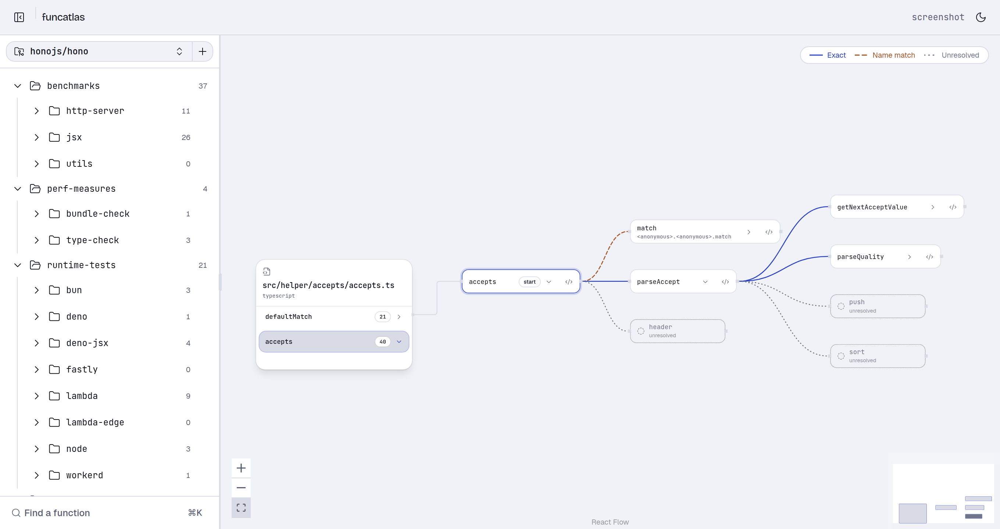

# funcatlas

An interactive visual map of a codebase. Point it at a public GitHub repository and it clones it,
extracts every function and call site with tree-sitter, resolves each call to the function it
reaches, and draws the result as a graph you can walk: file tree → file card → function mind-map →
highlighted source.

<picture>
  <source media="(prefers-color-scheme: dark)" srcset="apps/web/public/canvas-dark.png">
  
</picture>

<sup>hono's `accepts` helper, opened from its file card. Three calls leave it, drawn for how well
each is known.</sup>

**The part that matters: it tells you what it does not know.** Every call gets one of three
answers, and each is drawn as a different line.

| | Tier | Drawn | Means |
|---|---|---|---|
| ─── | `exact` | solid | The import was followed to a declaration, and only one function could be the target. |
| ─ ─ ─ | `name_match` | dashed | A function with that name is in scope. Another one elsewhere may be the one actually called. |
| · · · | `unresolved` | dotted | The call is real and its target is ambiguous: a barrel re-export, a default import, a path alias. |

Ambiguity resolves to `unresolved`, never to a guess, and an unresolved call is never coloured as
an error. A tool that guesses is worse than one that stops, because a wrong edge is read as fact
and costs more than the missing one it replaced. Unresolved callees are drawn as ghost nodes at the
edge of the map, labelled with the name the parser saw — the map showing its own boundary.

Built for one problem: large codebases do not fit in your head, and grep or go-to-definition only
ever shows you one file at a time, never the shape of the whole thing.

## Status

Phases 0 through 5 are done and merged. It works and it is usable: sign in, chart a public
repository, and explore it. Registering returns immediately and the parse runs on a queue; point a
GitHub webhook at it and the graph follows your pushes, rewriting only the rows a commit changed.

**There is no hosted instance.** You run it yourself, so the database and the graphs are yours and
stay on your machine.

## Languages

Eight, at two different depths. Support is not uniform, so it is not presented as though it were.

| Depth | Languages |
|---|---|
| **Resolved across files** — imports are followed, so a call reaches a definition in another file | TypeScript, TSX, JavaScript, JSX |
| **Extracted, resolved within a file** — every function and call site is charted, cross-file resolution is not built | Go, Rust, Python, Java |

Per-language limits are pinned by assertions rather than described, because a parser that quietly
produces *less* reads as one that worked. See [`docs/PARSING_STRATEGY.md`](docs/PARSING_STRATEGY.md).

## Running it

Two commands. You need **Docker**, plus `make` and `openssl` — both already present on macOS and
any Linux.

```bash
git clone https://github.com/ARCoder181105/funcatlas.git
cd funcatlas
make setup          # writes .env, generates secrets, creates the test database
docker compose up   # then open http://localhost:5173
```

Paste a public repository URL and explore it. `⌘K` finds any function by name.

> **`make setup` sets `FUNCATLAS_SINGLE_USER`, which means the API runs with no authentication.**
> That is what lets you skip registering a GitHub OAuth app. Compose publishes every port on
> `127.0.0.1`, so nothing off-box can reach it — but do not expose these ports, and do not run it
> this way on a server. Blank the value in `.env` to use real GitHub sign-in instead
> ([`docs/RISKS.md`](docs/RISKS.md) R39).

### With real GitHub sign-in

Blank `FUNCATLAS_SINGLE_USER` in `.env` and register an OAuth app at
<https://github.com/settings/developers> → **New OAuth App**:

| Field | Value |
|---|---|
| Application name | anything — `funcatlas (local)` |
| Homepage URL | `http://localhost:5173` |
| Authorization callback URL | `http://localhost:3000/auth/callback` |

Put the client id and secret into `.env` as `GITHUB_CLIENT_ID` and `GITHUB_CLIENT_SECRET`. The
scope requested is `read:user` and nothing more — funcatlas never writes to your account, and the
token is read once for your username and then never used again. It clones over public HTTPS, which
is why only public repositories work: the only scope that reads private ones is `repo`, and that
also grants **write** access to every private repository you can reach.

### Working on the code

`docker compose up` has no hot reload. For that, run the services natively — which needs three more
things installed:

- **Node 24+** and **pnpm** (`npm i -g pnpm`) — pnpm 11 does not run on Node 20
- **Go 1.25+** with a C toolchain (`gcc`) — tree-sitter uses cgo
- **golang-migrate** CLI — or the `migrate/migrate` Docker image, as CI does

```bash
pnpm install
make start          # infra in compose, api + web + worker natively, with watch
```

Stop the compose worker first if it is running: it consumes the queue the tests assert on, and
`make test` will tell you so rather than failing obscurely.

### Without the app

Parse a repository straight to stdout, no database and no API:

```bash
make go-run REPO=./services/parser/testdata/polyglot
cd services/parser && go run ./cmd/parser --repo ./testdata/resolve --format summary
```

## How it works

1. **Clone** the repository, depth one, over public HTTPS. Nothing in it is ever executed — no
   install, build or test scripts — because parsing only reads text. Symlinks fail the run rather
   than being followed, files over 1 MB are skipped, and file count and depth are capped.
2. **Extract** every function declaration and call site with tree-sitter, into a Go-native
   intermediate representation. One pinned grammar per extension, never shared: a mismatched
   grammar fails *silently* and drops every call in the file.
3. **Resolve** each call against a symbol table partitioned by language, so no edge can cross a
   language boundary, and tag it `exact`, `name_match` or `unresolved`.
4. **Store** functions and edges in Postgres, keyed so an incremental re-parse never orphans an
   edge.
5. **Serve** the graph behind a GitHub login. Every `/api` route is session-gated, and sessions are
   opaque ids in Redis rather than anything the browser can read.
6. **Explore** it on a React Flow canvas, where the edge style is the resolution confidence.

## What it does not do

Stated here rather than discovered later:

- **Public repositories only.** See the OAuth section above for why.
- **No hosted instance.** You run it.
- **No authentication by default.** `make setup` turns on single-user mode so you can skip
  registering an OAuth app. Fine on a laptop behind a loopback-only port map, wrong anywhere else
  ([`docs/RISKS.md`](docs/RISKS.md) R39).
- **An incremental re-parse still re-parses everything.** The *write* is scoped to changed files;
  the clone, extract and resolve are not. Resolution is whole-repo, and a partial symbol table
  would emit a confident edge where the whole repository would correctly say ambiguous
  ([`docs/RISKS.md`](docs/RISKS.md) R35).
- **The parser sandbox is a harness, not the running path.** `--network none`, a read-only rootfs
  and dropped capabilities apply under `make parser-isolated`; the queue worker spawns the binary
  as a plain subprocess. The input hardening in step 1 above is enforced everywhere. R38 and
  [`docs/SECURITY.md`](docs/SECURITY.md).
- **One file card at a time**, with as many function branches off it as you open.
- **Barrel re-export chains, default imports and `tsconfig` path aliases** all resolve to
  `unresolved`. Deliberately.

## Working on it

```bash
make start          # everything, then open :5173
make test           # TypeScript AND Go — `pnpm -r test` silently skips the parser
make lint && make typecheck
make go-vet         # not part of `make test`
make help           # every target
```

Integration tests read `TEST_DATABASE_URL` and skip when it is unset, so a green run that never
touched Postgres is possible — check that you created the test database above.

[`CONTRIBUTING.md`](CONTRIBUTING.md) is the place to start: what a good first change looks like,
how to add a language, and the four conventions that will fail review if you miss them.
[`CLAUDE.md`](CLAUDE.md) is the load-bearing summary of how this repository is organised and which
conventions bite if ignored; it is worth reading before a first change even though it is addressed
to an assistant.

## Layout

```
/apps/api             Fastify — auth, repo registration, graph endpoints, the parse worker
/apps/web             Vite + React — the landing page and the canvas
/packages/shared      Drizzle schema + Zod schemas, shared by api and web
/services/parser      Go — clone, extract, resolve, write to Postgres
/docs                 architecture, data model, parsing, security, risks, UI
```

## Stack

| Layer | Choice |
|---|---|
| Parser | Go + tree-sitter, pgx with explicit SQL, zap |
| Database | Postgres — edge tables and recursive CTEs |
| API | Fastify + Drizzle + postgres.js + Zod |
| Frontend | Vite + React 19 + React Flow + Tailwind v4 + shadcn/ui on Base UI |
| Queue | Redis + BullMQ, consumed by a Node worker that spawns the Go binary |
| Auth | GitHub OAuth (arctic/oslo), opaque sessions in Redis |
| Monorepo | pnpm workspaces + Turborepo |

Reasoning for each pick, and the rejected alternatives, is in
[`docs/TECH_STACK.md`](docs/TECH_STACK.md).

## Documentation

| Document | Owns |
|---|---|
| [`PRD.md`](PRD.md) | What we are building and what counts as done |
| [`PLAN.md`](PLAN.md) | The phase order, what closed each one, and what is still open |
| [`CONTRIBUTING.md`](CONTRIBUTING.md) | How to make a change here, and what review checks |
| [`CLAUDE.md`](CLAUDE.md) | Conventions, and what bites if ignored |
| [`docs/ARCHITECTURE.md`](docs/ARCHITECTURE.md) | Components and how they connect |
| [`docs/DATA_MODEL.md`](docs/DATA_MODEL.md) | Postgres schema |
| [`docs/PARSING_STRATEGY.md`](docs/PARSING_STRATEGY.md) | Extraction, resolution, per-language limits |
| [`docs/SECURITY.md`](docs/SECURITY.md) | Parsing untrusted repositories, and where the isolation actually applies |
| [`docs/RISKS.md`](docs/RISKS.md) | Open decisions and tracked risks |
| [`docs/UI_GUIDE.md`](docs/UI_GUIDE.md) | Visual direction, and what this must not look like |
| [`docs/CANVAS_DECISIONS.md`](docs/CANVAS_DECISIONS.md) | Why the canvas behaves the way it does |

## License

MIT. See [`LICENSE`](LICENSE).
